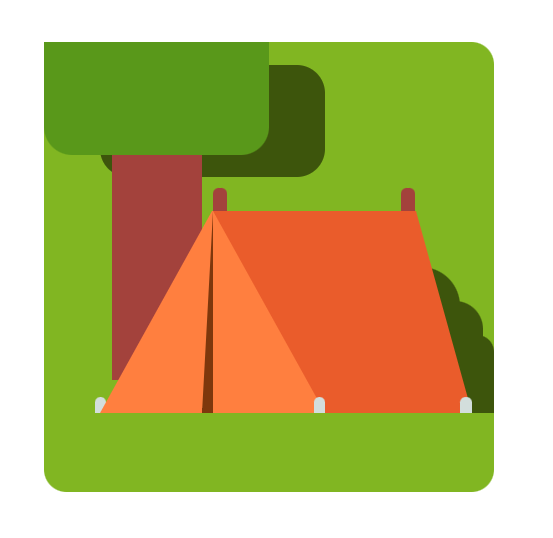

## Table of contents

- [Overview](#overview)
  - [Screenshot](#screenshot)
- [Sources](#source)
  - [Links](#links)
- [My process](#my-process)
  - [Built with](#built-with)
  - [What I learned](#what-i-learned)
  - [Continued development](#continued-development)
- [Author](#author)
- [Acknowledgments](#acknowledgments)

## Overview

### Screenshot

## Sources

### Links

- https://css-tricks.com/the-shapes-of-css/ : Really a great blog about CSS shapes and tricks on how you can customize them.
- https://css-tricks.com/working-with-shapes-in-web-design/ : This will help you in enhancing your knowledge about CSS shapes.
- https://colorhunt.co/ : One of my favourite site to take pre-made color palatte
- https://www.canva.com/colors/color-palettes/ : Helps you create a color palatte based on a picture you upload and also you can create your customized color palatte

## My process

### Built with

- Semantic HTML5 markup
- CSS custom properties

### What I learned

CSS arts are really fun and help to work on your css skills it helps you to practice css in a fun way. I get to lean about css positionings and selectors through this project.

### Continued development

I want to work upon my selectors skills and CSS animations so that I could create more upgrade projects and art as a frontend developer.

## Author

- Twitter - [@riyarai1511](https://twitter.com/riyarai1511)

## Acknowledgments

Lastly, I would like to thank everyone who posts the solutions of all the problems I stuck upon. People really works hard and contribute to technology that is really motivating and want to grow with them and enhance my skills.
